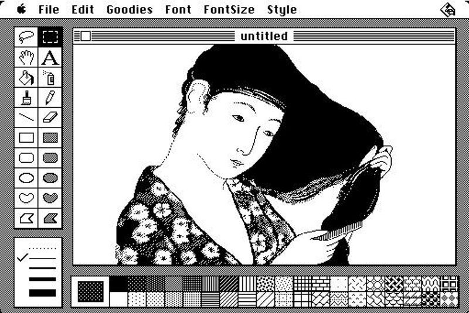

[![Contributors][contributors-shield]][contributors-url]
[![Forks][forks-shield]][forks-url]
[![Stargazers][stars-shield]][stars-url]
[![The Unlicense][license-shield]][license-url]
[![Issues][issues-shield]][issues-url]
[![LinkedIn][linkedin-shield]][linkedin-url]

---

# MacPaint and QuickDraw Source Code

    
      
    <strong><a href="https://github.com/msammels/MacPaint-QuickDraw/tree/main/src">Explore the code »</a></strong>

|  |
|:---------------------------------------------------------------------:|
|   <cite><strong>Early MacPaint drawing by Susan Kare</strong></cite>  |

# About the Project
The Apple Macintosh combined brilliant design in hardware and in software. The drawing program MacPaint, which was
released with the computer in January of 1984, was an example of that brilliance both in what it did, and in how it
was implemented.

[**MacPaint**](https://github.com/msammels/MacPaint-QuickDraw/tree/main/src/MacPaint) is the drawing program application which interacts with the user, interprets mouse and keyboard requests,
and decides what is to be drawn where. The high-level logic is written in Apple Pascal, packaged in a single file with
5,822 lines. There are an additional 3,583 lines of code in assembler language for the underlying Motorola 68000
microprocessor, which implement routines needing high performance and some interfaces to the operating system.

[**QuickDraw**](https://github.com/msammels/MacPaint-QuickDraw/tree/main/src/QuickDraw) is the Macintosh library for creating bit-mapped graphics, which was used by MacPaint and other
applications. It consists of a total of 17,101 lines in 36 files, all written in assembler language for the 68000.

<a href="#">🔝</a>

---

## The Story of MacPaint and QuickDraw
MacPaint was written by Bill Atkinson, who was a member of the original Macintosh development team. He based it on his
earlier LisaSketch (also called SketchPad) for the unsuccessful Apple Lisa computer, so he originally called it
MacSketch. He started work on the Mac version in early 1983.

Atkinson also created QuickDraw first for the Lisa, as LisaGraf. Andy Hertzfeld, another key member of the team,
considers QuickDraw

> "the single most significant component of the original Macintosh technology in it's ability to push pixels around in
> the frame buffer at blinding speeds to create the celebrated user interface."[^2]

SketchPad used menus to select patterns and styles to draw with, but Bill replaced them with permanent palettes at the
bottom of the screen, and added another prominent palette on the left that contained drawing tools.

One of the problems with many early graphics programs was that as you dragged a shape or image across the screen, it
had to be erased from it's old position before being redrawn, which caused a distracting flicker. Bill eliminated the
flicker by composing everything in a hidden memory buffer, which was then transferred to the screen quickly when it was
completely ready.

Around April 1983, Bill changed the name from MacSketch to MacPaint, and started adding new features almost on a daily
basis:

- The "Fat Bits" mode magnified the screen areas so individual pixels could be edited.
- The "Paint Bucket" tool identified and filled closed areas with a pattern.
- The "Lasso" tool selected non-rectangular shapes.

He even wrote an elaborate character recognition routine to turn pixilated characters back into text, but in the end
removed it because he wanted MacPaint to be used a great drawing program, and not as an inadequate word processor.

In writing MacPaint, Bill was as concerned with whether human readers would understand the code as he was with what the
computer would do with it. He later said about software in general,

> "It's an art form, like any other arm form... I would spend time rewriting whole sections of code to make them more
> cleanly organised, more clear. I'm a firm believer that the best way to prevent bugs is to make it so that you can read
> through the code and understand exactly what it's doing... And maybe that was a little bit counter to what I ran into
> when I first came to Apple... If you want to get it smooth, you've got to rewrite it from scratch at least five times."[^1]

MaPaint was finished in October 1983. It coexisted in only 128K of memory with QuickDraw and portions of the operating
system, and ran on a 8Mhz processor that didn't have floating-point operations. Even with those meager resources,
MacPaint provided a level of performance and function that established a new standard for personal computers.

<a href="#">🔝</a>

---

# Anecdotes
There are many wonderful anecdotes about the original Macintosh team collected and preserved by Andy Hertzfeld at
www.folklore.org.

## How Long Did It Take?
A reporter asked Steve Jobs, "How many man-years did it take to write QuickDraw?" Steve asked Bill, who said, "Well I
worked on it on and off for four years." Steve then told the reporter, "Twenty-four man-years". Steve figured, with
ample justification, that one Atkinson year was the equivalent of six ordinary programmer years.

## How Do You Measure Programmer Productivity?
When the Lisa team was pushing to finalise their software in 1982, project managers started requiring programmers to
submit weekly forms reporting on the number of lines of code that had written. Bill Atkinson thought that was silly.
For the week in which we had rewritten QuickDraw's region calculation routines to be six times faster and 2,000 lines
shorter, he put "-2,000" on the form. After a few more weeks the managers stopped asking to fill out the form and he
gladly complied.

<a href="#">🔝</a>

# Epilogue
MacPaint development was taken over by Claris, a software subsidiary of Apple created in 1987. The last version was
released in 1998, and it was discontinued in 1998.

After years of designing software tools to empower other creative people, Bill Atkinson shifted his focus to his own
artistic creations. He is the proprietor of [Bill Atkinson Photography](http://billatkinson.com)

<a href="#">🔝</a>

# Contact
Michael Sammels - [@msammels](https://twitter.com/msammels) | michael@sammels.net

You can contact [Apple Support here](https://support.apple.com)

<a href="#">🔝</a>

[contributors-shield]:  https://img.shields.io/github/contributors/msammels/MacPaint-QuickDraw?style=for-the-badge
[contributors-url]:     https://github.com/msammels/MacPaint-QuickDraw/graphs/contributors

[forks-shield]:         https://img.shields.io/github/forks/msammels/MacPaint-QuickDraw?style=for-the-badge
[forks-url]:            https://github.com/msammles/MacPaint-QuickDraw/network/members

[stars-shield]:         https://img.shields.io/github/stars/msammels/MacPaint-QuickDraw?style=for-the-badge
[stars-url]:            https://github.com/msammels/MacPaint-QuickDraw/stargazers

[issues-shield]:        https://img.shields.io/github/issues/msammels/MacPaint-QuickDraw?style=for-the-badge
[issues-url]:           https://github.com/msammels/MacPaint-QuickDraw/issues

[license-shield]:       https://img.shields.io/github/license/msammels/MacPaint-QuickDraw.svg?style=for-the-badge
[license-url]:          https://github.com/msammels/MacPaint-QuickDraw/blob/main/LICENSE

[linkedin-shield]:      https://img.shields.io/badge/-LinkedIn-black.svg?style=for-the-badge&logo=linkedin&colorB=555
[linkedin-url]:         https://linkedin.com/in/msammels

[^1]: [Bill Atkinson and Andy Hertzfeld, MacPaint Oral History](assets/102658007-05-01-acc.pdf) conducted by Grady Brooch, 2004, Computer History Museum; transcript
[^2]: [Hertzfeld, Any: The Original Macintosh](http://www.folklore.org/). Anecdotes about the development of Apple's original Macintosh computer, and the people who created it